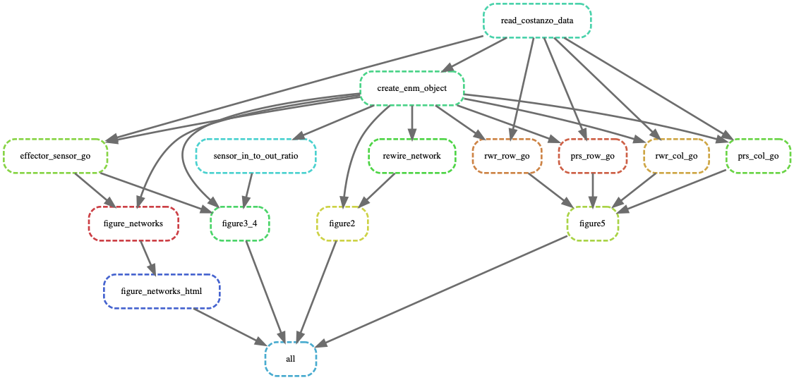

Elastic Network Modeling of Cellular Networks Unveils Sensor and Effector Genes that Control Information Flow
==============================

doi: this will be updated

`Supplementary Data 1` can be found under `data/supp/`

Project Organization
------------

    ├── LICENSE
    ├── Snakefile                      <- Snakemake with rules to create intermediate data and figures from raw data 
    ├── Snakefile_different_thresholds <- Snakemake with rules to create intermediate data and figures from raw data 
    ├── README.md                      <- The top-level README for people using this project.
    ├── data
    │   ├── intermediate                       <- Intermediate data that has been transformed and used for figure generation.
    │   └── raw                        <- The original, immutable data should be placed here.
    ├── docs                           <- A default Sphinx project; see sphinx-doc.org for details
    │
    ├── notebooks                      <- Jupyter and/or Rmarkdown notebooks for figure generation.
    │
    ├── reports                        <- Folder to re-generate notebooks as HTML, PDF, LaTeX, etc.
    │   └── figures                    <- Figures used in the paper 
    ├── reports_done                   <- Generated notebooks as HTML, PDF, LaTeX, etc.
    │
    ├── enm_snakemake.yml              <- The environment file for reproducing the analysis conda environment. Used for python scripts in Snakemake
    │
    ├── setup.py                       <- makes project pip installable (pip install -e .) so enm can be imported
    ├── enm                            <- Source code for use in this project.
    │   ├── __init__.py                <- Makes enm a Python module
    │   ├── Enm.py                     <- Contains Enm class and related functions 
    │   ├── visualize.py               <- Makes enm a Python module
    │   ├── utils.py                   <- Contains functions that have been used in this project 
    │
    ├── scripts                        <- Contains scripts to generate intermediate data/results. All scripts could be run with Snakemake 
    └── tox.ini                        <- tox file with settings for running tox; see tox.readthedocs.io


--------

This repo contains a Snakefile and thus all pipeline can be run using Snakemake. 

Snakemake will use the raw data provided under `data/raw` to generate all intermediate data and results for figure generation.

Raw data could be downloaded from `https://thecellmap.org/costanzo2016/data_files/Genetic%20interaction%20profile%20similarity%20matrices.zip`

Necessary files for Gene Ontology analysis were downloaded from Gene ontology consortium or from SGD on May 20, 2021.

Following links could be used and should be placed under `data/raw/ontology`: 

```
https://downloads.yeastgenome.org/curation/chromosomal_feature/SGD_features.tab

http://purl.obolibrary.org/obo/go/go-basic.obo

http://current.geneontology.org/annotations/sgd.gaf.gz
```

The Rmarkdown and Jupyter notebooks under `notebooks` directory can be used to create the figures in the paper. The html files for those notebooks are shared under `reports_done` folder. A rerun of snakemake pipeline will create `html` files to `reports` folder.

To re-create the figures/reports starting from raw data, first create a conda environment and install snakemake:

```bash
conda create -n enm_package_env
conda activate enm_package_env
conda install snakemake
```

Then run snakemake:

```bash
snakemake -j10 --use-conda --conda-frontend conda all
```

This will run rules based on the following DAG:


`--use-conda --conda-frontend` directive will download and install necessary packages and run the scripts in a conda environment for both python/jupyter files. Figure 2 and Figure 5 dependencies will take longer to run, depending on cpu and number of cores. I don't suggest running them blindly. 

Conda environment and R do not always play nicely. Rmarkdown files will install the dependencies when snakemake is run. Depending on the system this might cause errors but when the prerequisites are installed, there won't be any more issues. 

Additionally `Snakefile_different_thresholds` file can be used to create supplementary figures and related data for Supplementary Figures S1, S3 and S4. 


<p><small>Project based on the <a target="_blank" href="https://drivendata.github.io/cookiecutter-data-science/">cookiecutter data science project template</a>. Though many edits were applied. #cookiecutterdatascience</small></p>
